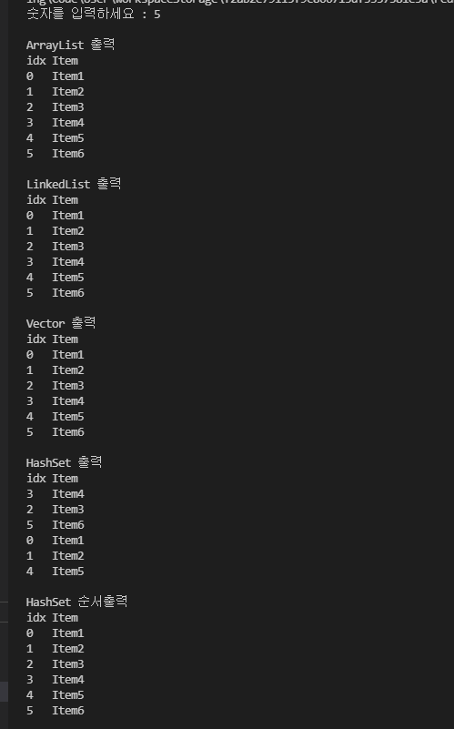
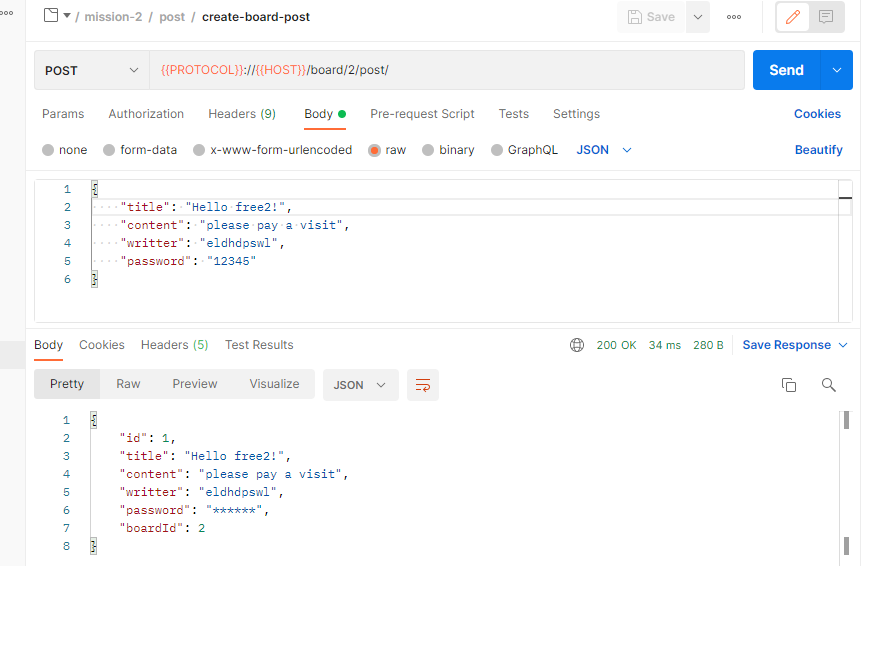
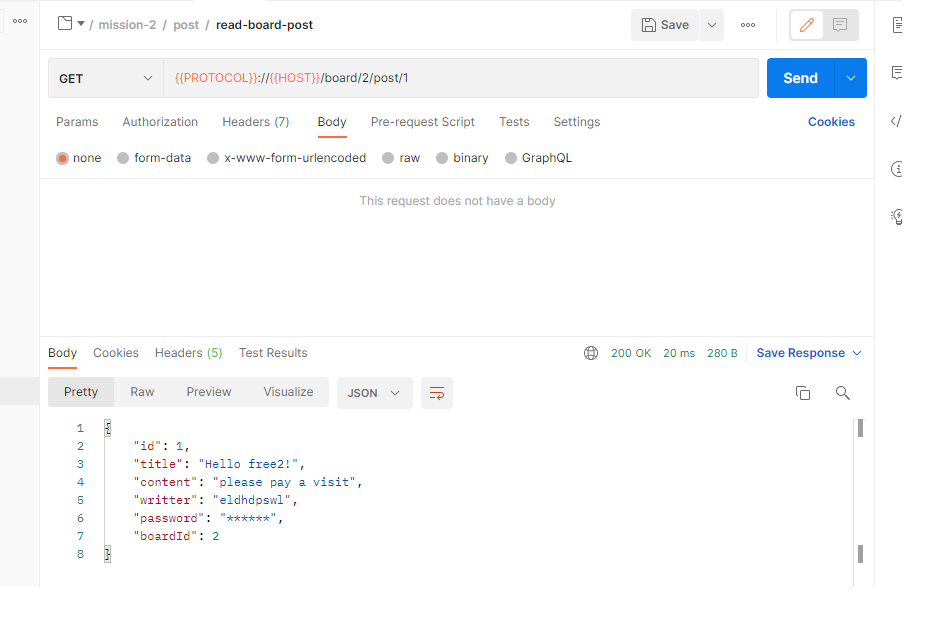
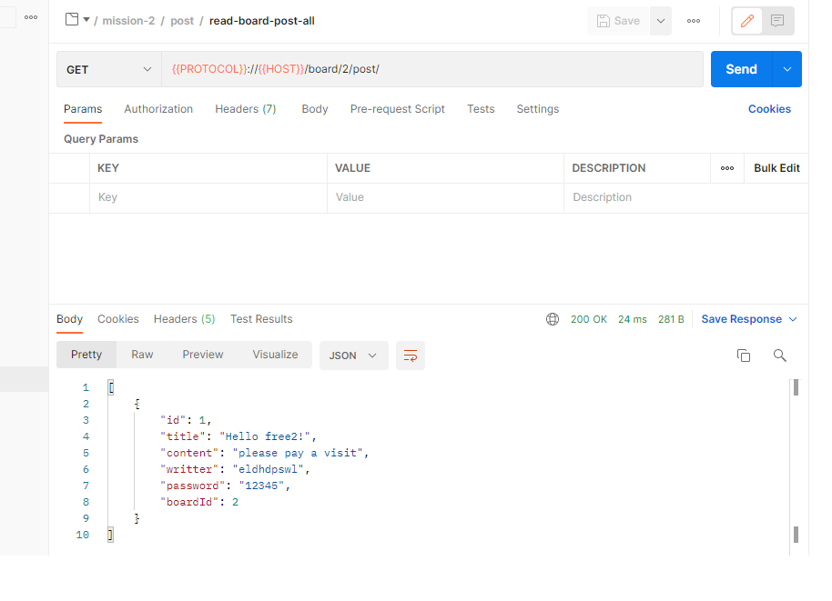
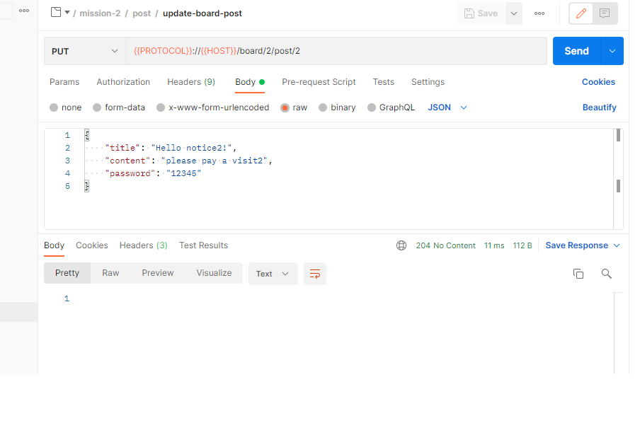
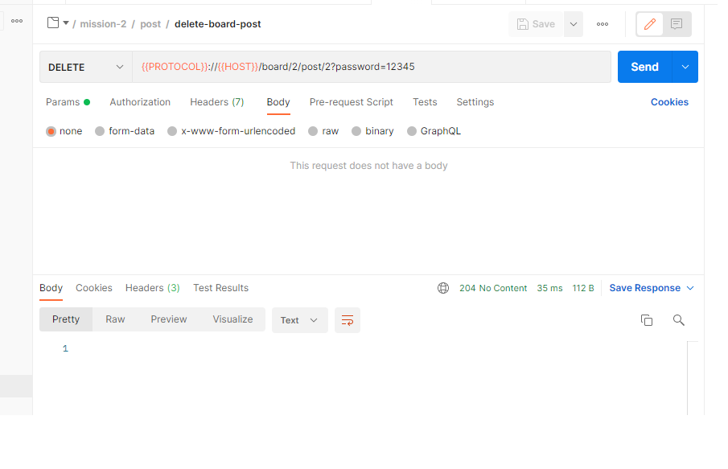
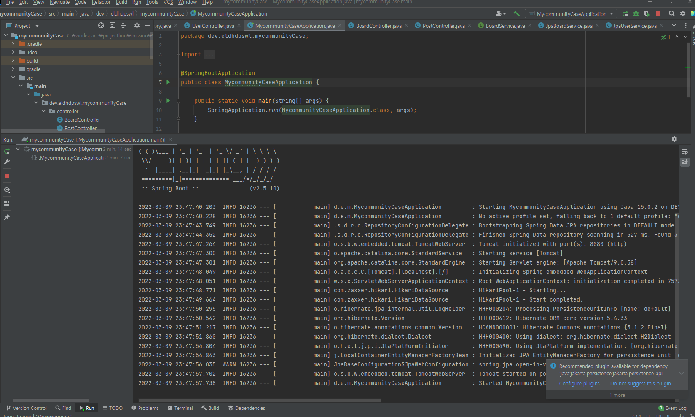
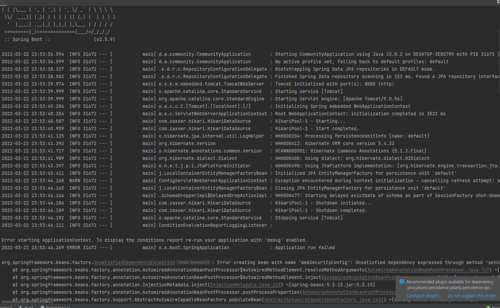

# Spring_Boot_Mission

### The Origin: Java Spring Boot - Mission Page

## Mission 1
#### 소스코드 실행결과

## Mission 2

#### 1.게시판 생성(create-board)

#### 1.게시판 불러오기(read-board-id)

#### 1.게시판 전체 불러오기(read-board-all)

#### 1.게시판 수정(update-board)

#### 1.게시판 삭제(delete-board)

#### 2.게시글 생성(create-board-post)

#### 2.게시글 불러오기(read-board-post)

#### 2.게시글 전체 불러오기(read-board-post-all)

#### 2.게시글 수정(update-board-post)

#### 2.게시글 삭제(delete-board-post)

## Mission 3

#### 소스코드 실행결과

## Mission 4

#### 소스코드 실행결과

